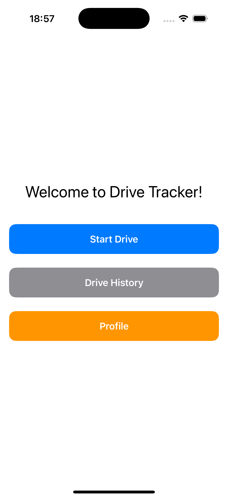
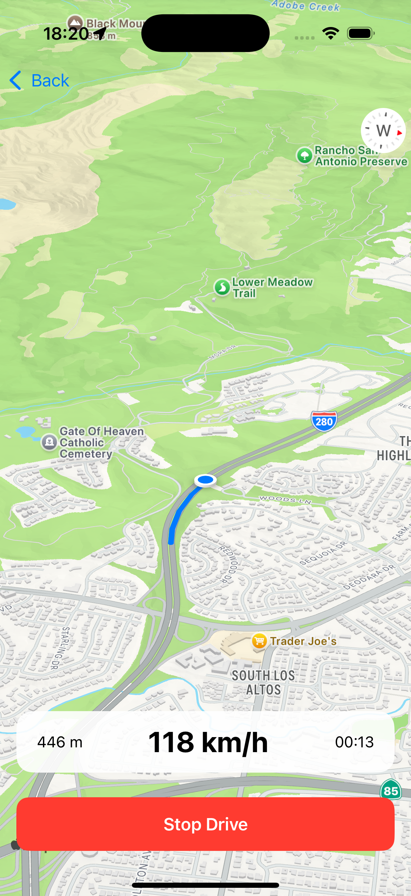
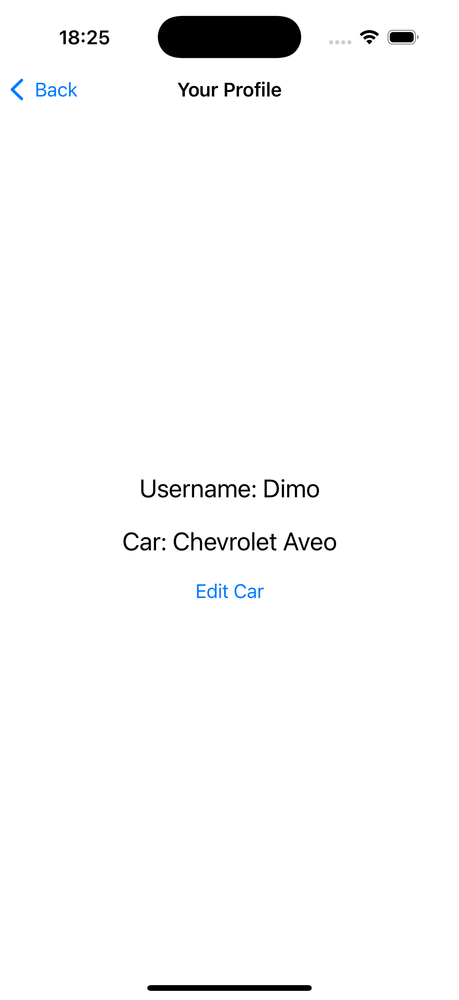
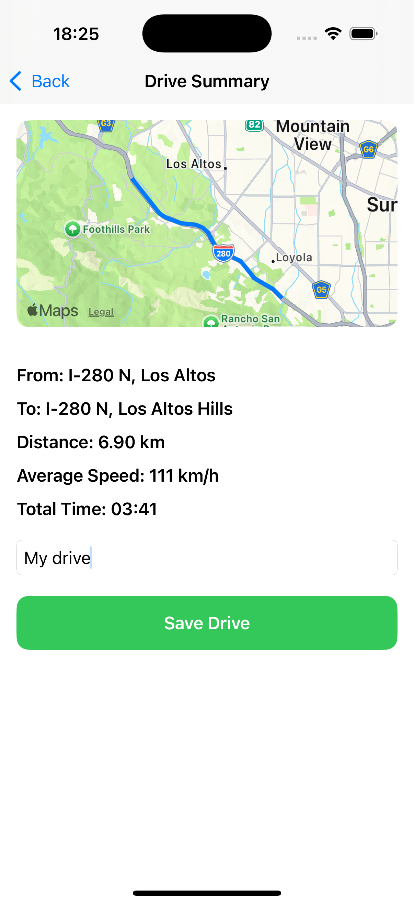
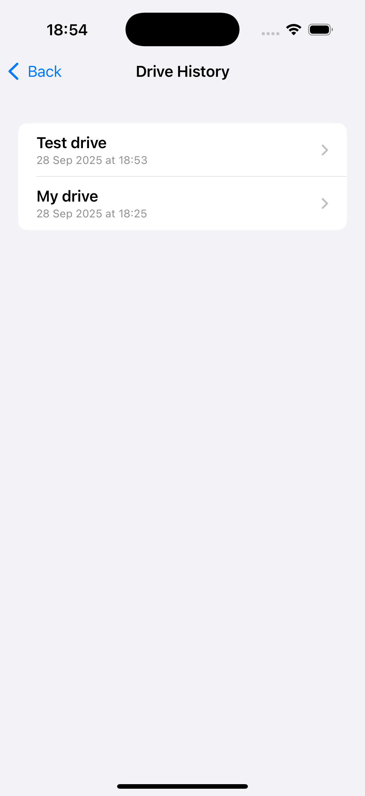
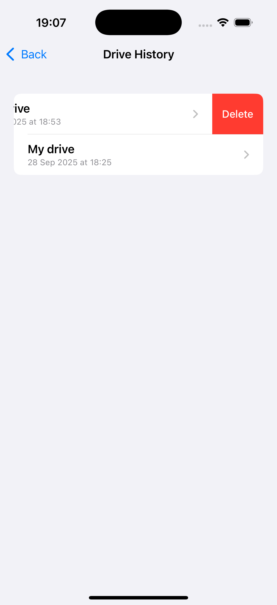

# DriveTracker

DriveTracker is an iOS app built with **SwiftUI** and **MapKit** that lets you track your drives in real time, save them for later, and manage a personal driving profile.  

## Features

- **Live Route Tracking**  
  Track your location in real-time with a live map and a polyline route.

- **Drive Statistics**  
  Automatically calculates distance, average speed, and duration for every drive.

- **Start & End Addresses**  
  Addresses for where you started and finished your drive.

- **Save Drives**  
  Name and store your completed drives locally. Access them anytime in the history screen.

- **Drive History**  
  View all your past drives, sorted by date. Tap to see detailed summaries.

- **User Profile**  
  Create a profile with your username and car information.  
  - Edit car details later from your profile overview.  
  - Future updates: multiple cars, fuel consumption tracking, and car selection per drive.

## Screenshots

  
  
  
  
  
  

## Tech Stack

- **Language:** Swift
- **Frameworks:** SwiftUI, MapKit, CoreLocation
- **Architecture:** MVVM-inspired, with `Manager` classes for persistence and `View`s for UI
